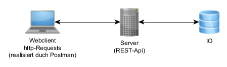
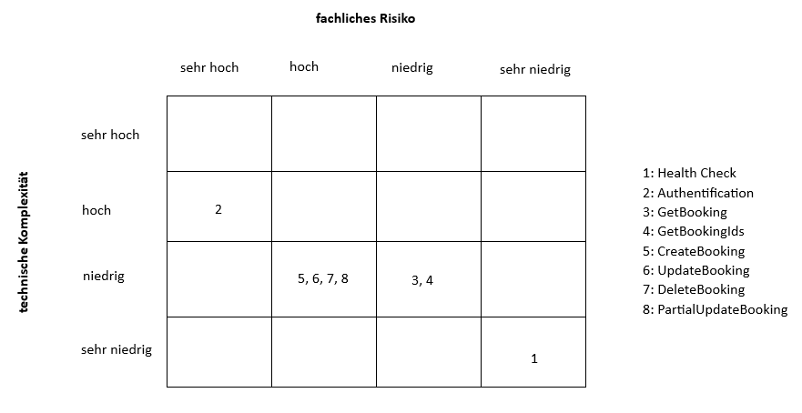

# QS_Testautomation

## Gruppe
 * Marco Lappe
 * Timo Max
 * Robin Wollenschläger

## Testscope
Wir testen die REST-Api des durch https://restful-booker.herokuapp.com/apidoc/index.html bereitgestellten Webservices. Dies beinhaltet keinerlei GUI und der Webclient zum Testen wird durch Postman realisiert.

Wir haben uns darauf festgelegt, nur die Endpunkte zu testen, bei denen Daten im JSON-Format ausgetauscht werden. Die XML-Datenübertragung wird nicht getestet. 

## Testziele
Qualitätsziele nach ISO25010:
- Funktionalität der REST-API Endpunkte testen 
- Verlässlichkeit der REST-API Endpunkte testen (Was passiert bei falschen Eingaben?)

Es gibt neben diesen beiden funktionalen Tests auch noch nicht-funktionale Tests (z.B. Performancetests), welche für uns allerdings nicht relevant sind.  

## Teststufen
Wir betrachten hier ein Einzelsystem beziehungsweise Schnittstellen zwischen Komponenten, deshalb handelt es sich um einen *Systemtest*.

## Testobjekte
Jeder Endpunkt (z.B. *create booking via POST*) stellt ein eigenes Testobjekt dar, zu welchem dann die entsprechenden Testfälle geschrieben werden.
Testobjekte lassen sich nach folgenden Ansätzen bilden:
- funktionale Struktur
- prozessuale Struktur
- Schnittstellen 

In unserem Fall haben wir die Testobjekte nach der **funktionalen Struktur** (fachlicher Bezug) gebildet. 

## Risikomanagement 
Das Risikomanagement stellt eine Methode dar, um die Reihenfolge der Ausführung der Testfälle festzulegen, wobei immer ein Bezug zu den Testobjekten (hier: API-Endpunkte) besteht.

Für die Risikoanalyse betrachtet man einerseits das **fachliche Risiko** und andererseits die **technische Komplexität**, wobei dazu die Kriterien *Auswirkung auf den Kunden*, *exisitert ein Workaround?* und *Anzahl der beteiligten Klassen* herangezogen werden können. Es wird folgende Abstufung verwendet: **sehr hoch - hoch - niedrig - sehr niedrig**

- Es wäre möglich den Health-Check vom Scope auszuschließen, da dieser keine direkte Relevanz für die Funktionalität hat. Es besteht somit kaum ein fachliches Risiko und eine sehr geringe technische Komplexität. 
- Der Auth-Endpunkt hat das höchste fachliche Risiko (sehr hoch) und eine hohe Komplexität.
- Die Get-Endpunkte haben ein niedriges Risiko und eine niedrige Komplexität. 
- Create, Update und Delete haben wiederum ein hohes Risiko und eine niedrige Komplexität. Der Update-Endpunkt ist der einzige für den ein Workaround existiert. Man kann eine Buchung aktualisieren, indem man sie löscht und neu anlegt. 

Bei der Automation haben wir links unten in der Matrix (hohes Risiko + niedrige Komplexität) begonnen und anschließend Stück für Stück alle Endpunkte getestet.

Eine Metrik zur Bewertung einer Testautomation kann die Risikoabdeckung sein. Durch unsere erstellte Testautomation wird das gesamte, in der Risikoanalyse bewertete, Risiko abgedeckt, da zu allen Testobjekten die entsprechenden Testfälle implementiert wurden.

## Toolauswahl
* **Postman**
* einfach benutzbar
* kostenlos für unsere Zwecke
* geringe Programmierkenntnisse (Snippets, GUI)
* kompatibel/integrierbar mit GitHub
* für funktionale Tests geeignet

## Framework
* TF-Design erfolgt mit Postman 
* Ausführung (TEX) erfolgt in Postman 
* Testreporting mit Postman
* Testdatenmanagement erfolgt mit Postman
* Toolsetup: Konfigurationsmanagement mit Postman + Github Integration (Versionsverwaltung)

## Testergebnisse 
Testergebnisse der Automation siehe [Restful-Booker.postman_test_run.json](https://github.com/Marco-374/QS_Testautomation/blob/26a94df385a77edc97683e98a1050f6f57f5b43a/Restful-Booker.postman_test_run.json) 

Die Ergebnisse können (wie die [Collection](https://github.com/Marco-374/QS_Testautomation/blob/26a94df385a77edc97683e98a1050f6f57f5b43a/postman_collections/restful-booker.json) auch) in Postman importiert werden. Siehe dazu: https://learning.postman.com/docs/getting-started/importing-and-exporting-data/#importing-postman-data

Aufgrund von fehlerhaftem Verhalten in der API schlagen drei Testfälle fehl. 

